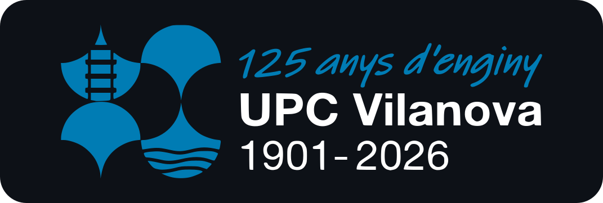

 
##### CTF Event based in Vilanova i la Geltrú - By students, for students.

## What is VilaHack?
VilaHack is a student hackathon in Vilanova i la Geltrú: a weekend of 24 hours of hacking in a Capture the Flag (CTF) format. Over two days, teams of four students face challenges where their goal is to find the hidden flag, earn points, and finish on the podium.

VilaHack is welcoming to all levels, from people who have never opened a terminal to experienced experts. Beyond the competition, it’s a space to learn, collaborate, and have fun, with a variety of activities that make a truly unique university experience.

### Food
We provide meals, drinks, and snacks throughout the event, so participants have the energy to find the next flag.

### Rest
There are areas where participants can rest and catch some sleep to stay fresh for the final sprint.

### Prizes
More than 1000€ in prizes, rewards for the best teams, and even more surprise perks!

## Sponsors
You can be our next edition's sponsor! Apply at https://vilahack.com/

## Supported by

